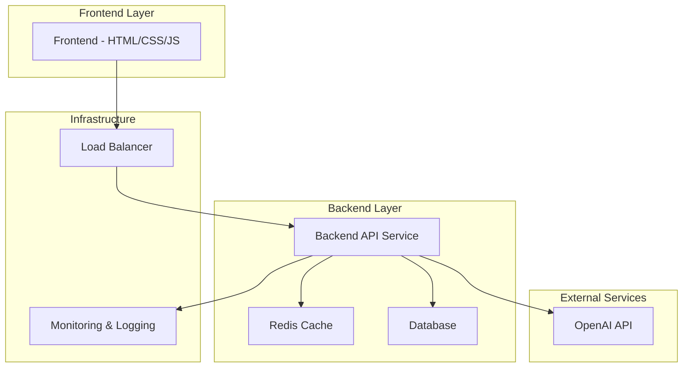

# Technical Architecture Document
## OpenAI API Integration for BankGPT

### Architecture Overview

This document outlines the technical architecture for integrating OpenAI's APIs into the existing BankGPT chatbot application.



### Component Architecture

#### 1. Frontend Layer (Minimal Changes)
**Current State**: Static HTML/CSS/JavaScript
**Modifications**: API client integration

```javascript
// New API Client Module
class BankGPTClient {
  constructor(baseURL) {
    this.baseURL = baseURL;
    this.conversationId = this.generateConversationId();
  }

  async sendMessage(message) {
    try {
      const response = await fetch(`${this.baseURL}/api/chat`, {
        method: 'POST',
        headers: {
          'Content-Type': 'application/json',
        },
        body: JSON.stringify({
          message,
          conversationId: this.conversationId,
        }),
      });

      if (!response.ok) {
        throw new Error(`HTTP ${response.status}: ${response.statusText}`);
      }

      return await response.json();
    } catch (error) {
      console.error('API Error:', error);
      throw error;
    }
  }
}
```

#### 2. Backend API Service (New Component)
**Technology Stack**: Node.js + Express.js
**Purpose**: Secure OpenAI API integration and business logic

```javascript
// Backend Service Architecture
const express = require('express');
const OpenAI = require('openai');
const rateLimit = require('express-rate-limit');

class BankGPTService {
  constructor() {
    this.app = express();
    this.openai = new OpenAI({
      apiKey: process.env.OPENAI_API_KEY,
    });
    this.setupMiddleware();
    this.setupRoutes();
  }

  setupMiddleware() {
    // Security middleware
    this.app.use(require('helmet')());
    this.app.use(require('cors')());
    
    // Rate limiting
    this.app.use(rateLimit({
      windowMs: 15 * 60 * 1000, // 15 minutes
      max: 100 // limit each IP to 100 requests per windowMs
    }));
    
    this.app.use(express.json());
  }

  setupRoutes() {
    this.app.post('/api/chat', this.handleChatRequest.bind(this));
    this.app.get('/api/health', this.handleHealthCheck.bind(this));
  }

  async handleChatRequest(req, res) {
    try {
      const { message, conversationId } = req.body;
      
      // Validate input
      if (!message || typeof message !== 'string') {
        return res.status(400).json({ error: 'Invalid message' });
      }

      // Get conversation context
      const context = await this.getConversationContext(conversationId);
      
      // Generate response
      const response = await this.generateAIResponse(message, context);
      
      // Save conversation
      await this.saveConversation(conversationId, message, response);
      
      res.json({ response });
    } catch (error) {
      console.error('Chat request error:', error);
      res.status(500).json({ error: 'Internal server error' });
    }
  }
}
```

#### 3. OpenAI Integration Service

```javascript
class OpenAIService {
  constructor() {
    this.client = new OpenAI({
      apiKey: process.env.OPENAI_API_KEY,
    });
    this.model = process.env.OPENAI_MODEL || 'gpt-3.5-turbo';
  }

  async generateResponse(message, conversationHistory = []) {
    const systemPrompt = this.buildBankingSystemPrompt();
    const messages = this.formatConversationHistory(
      systemPrompt,
      conversationHistory,
      message
    );

    try {
      const response = await this.client.chat.completions.create({
        model: this.model,
        messages: messages,
        max_tokens: parseInt(process.env.OPENAI_MAX_TOKENS) || 500,
        temperature: 0.7,
        presence_penalty: 0.1,
        frequency_penalty: 0.1,
      });

      // Track usage
      this.trackTokenUsage(response.usage);

      return {
        text: response.choices[0].message.content,
        usage: response.usage,
      };
    } catch (error) {
      console.error('OpenAI API Error:', error);
      throw new Error(`OpenAI API Error: ${error.message}`);
    }
  }

  buildBankingSystemPrompt() {
    return `You are BankGPT, a professional AI banking advisor with expertise in personal finance, banking products, and financial planning.

Your role:
- Provide helpful, accurate banking and financial advice
- Explain complex financial concepts in simple terms
- Recommend appropriate banking products and services
- Help users make informed financial decisions

Guidelines:
- Always maintain a professional but friendly tone
- Provide practical, actionable advice
- Include disclaimers for major financial decisions
- Recommend consulting with licensed professionals when appropriate
- Focus on educational content rather than specific product recommendations
- Never provide investment advice that could be considered financial planning
- Always prioritize the user's financial wellbeing

Banking Topics You Cover:
- Savings accounts and interest rates
- Checking accounts and banking fees
- Credit scores and credit improvement
- Loans and mortgages
- Basic investment concepts
- Budgeting and financial planning
- Debt management strategies
- Banking security and fraud prevention

Keep responses conversational, informative, and within 2-3 paragraphs unless the user specifically asks for detailed information.`;
  }

  formatConversationHistory(systemPrompt, history, currentMessage) {
    const messages = [
      { role: 'system', content: systemPrompt }
    ];

    // Add conversation history (limit to last 10 exchanges to manage tokens)
    const recentHistory = history.slice(-10);
    recentHistory.forEach(item => {
      messages.push(
        { role: 'user', content: item.user },
        { role: 'assistant', content: item.assistant }
      );
    });

    // Add current message
    messages.push({ role: 'user', content: currentMessage });

    return messages;
  }

  trackTokenUsage(usage) {
    const cost = this.calculateCost(usage);
    
    // Log usage for monitoring
    console.log(`OpenAI Usage: ${usage.total_tokens} tokens, Cost: $${cost.toFixed(4)}`);
    
    // Store in database/analytics service
    this.saveUsageMetrics(usage, cost);
  }

  calculateCost(usage) {
    // GPT-3.5-turbo pricing (as of 2024)
    const inputCostPer1K = 0.0005;
    const outputCostPer1K = 0.0015;
    
    return (usage.prompt_tokens * inputCostPer1K / 1000) + 
           (usage.completion_tokens * outputCostPer1K / 1000);
  }
}
```

#### 4. Conversation Management Service

```javascript
class ConversationService {
  constructor(redisClient, database) {
    this.redis = redisClient;
    this.db = database;
  }

  async getConversationContext(conversationId) {
    try {
      // Try to get from cache first
      const cached = await this.redis.get(`conversation:${conversationId}`);
      if (cached) {
        return JSON.parse(cached);
      }

      // Fallback to database
      const dbResult = await this.db.conversations.findOne({
        id: conversationId
      });

      const context = dbResult ? dbResult.history : [];
      
      // Cache for future requests
      await this.redis.setex(
        `conversation:${conversationId}`, 
        3600, // 1 hour TTL
        JSON.stringify(context)
      );

      return context;
    } catch (error) {
      console.error('Error getting conversation context:', error);
      return [];
    }
  }

  async saveConversation(conversationId, userMessage, aiResponse) {
    try {
      const conversationEntry = {
        user: userMessage,
        assistant: aiResponse,
        timestamp: new Date().toISOString()
      };

      // Update database
      await this.db.conversations.updateOne(
        { id: conversationId },
        { 
          $push: { history: conversationEntry },
          $set: { lastUpdated: new Date() }
        },
        { upsert: true }
      );

      // Update cache
      const context = await this.getConversationContext(conversationId);
      context.push(conversationEntry);
      
      await this.redis.setex(
        `conversation:${conversationId}`,
        3600,
        JSON.stringify(context)
      );

    } catch (error) {
      console.error('Error saving conversation:', error);
    }
  }

  async summarizeConversation(conversationHistory) {
    // If conversation gets too long, summarize older parts
    if (conversationHistory.length > 20) {
      const olderMessages = conversationHistory.slice(0, -10);
      const recentMessages = conversationHistory.slice(-10);
      
      const summary = await this.generateSummary(olderMessages);
      
      return [
        { role: 'system', content: `Previous conversation summary: ${summary}` },
        ...recentMessages
      ];
    }
    
    return conversationHistory;
  }
}
```

#### 5. Caching Strategy

```javascript
class CacheService {
  constructor(redisClient) {
    this.redis = redisClient;
  }

  async getCachedResponse(userMessage) {
    // Create cache key from normalized message
    const cacheKey = this.createCacheKey(userMessage);
    
    try {
      const cached = await this.redis.get(cacheKey);
      if (cached) {
        const response = JSON.parse(cached);
        response.fromCache = true;
        return response;
      }
    } catch (error) {
      console.error('Cache retrieval error:', error);
    }
    
    return null;
  }

  async setCachedResponse(userMessage, response, ttl = 3600) {
    const cacheKey = this.createCacheKey(userMessage);
    
    try {
      await this.redis.setex(
        cacheKey,
        ttl,
        JSON.stringify(response)
      );
    } catch (error) {
      console.error('Cache storage error:', error);
    }
  }

  createCacheKey(message) {
    // Normalize message for caching
    const normalized = message
      .toLowerCase()
      .replace(/[^\w\s]/g, '')
      .trim();
    
    return `response:${Buffer.from(normalized).toString('base64')}`;
  }
}
```

### Data Flow Architecture

#### 1. Request Flow
```
User Input → Frontend Validation → API Request → Backend Validation 
→ Check Cache → OpenAI API (if not cached) → Response Processing 
→ Save to Database → Cache Response → Return to Frontend → Display
```

#### 2. Error Handling Flow
```
Error Occurs → Log Error → Check Error Type → Apply Retry Logic 
→ Fallback to Cache → Fallback to Static Response → User Notification
```

#### 3. Cost Control Flow
```
API Request → Token Count → Cost Calculation → Budget Check 
→ Rate Limiting → Usage Logging → Alert if Threshold Exceeded
```

### Security Architecture

#### 1. API Key Management
```javascript
class SecurityService {
  constructor() {
    this.apiKey = process.env.OPENAI_API_KEY;
    this.validateApiKey();
  }

  validateApiKey() {
    if (!this.apiKey || !this.apiKey.startsWith('sk-')) {
      throw new Error('Invalid OpenAI API key');
    }
  }

  // Implement key rotation
  async rotateApiKey() {
    // Implementation for key rotation
  }
}
```

#### 2. Input Validation
```javascript
const validation = {
  validateChatMessage: (message) => {
    if (!message || typeof message !== 'string') {
      throw new Error('Invalid message format');
    }
    
    if (message.length > 1000) {
      throw new Error('Message too long');
    }
    
    // Remove potentially harmful content
    return message.replace(/<script\b[^<]*(?:(?!<\/script>)<[^<]*)*<\/script>/gi, '');
  },

  validateConversationId: (id) => {
    if (!id || typeof id !== 'string' || !/^[a-zA-Z0-9-_]+$/.test(id)) {
      throw new Error('Invalid conversation ID');
    }
    return id;
  }
};
```

### Monitoring Architecture

#### 1. Performance Metrics
```javascript
class MetricsService {
  constructor() {
    this.metrics = {
      requestCount: 0,
      responseTime: [],
      errorCount: 0,
      tokenUsage: 0,
      costs: 0
    };
  }

  recordRequest(responseTime, tokenUsage, cost, error = null) {
    this.metrics.requestCount++;
    this.metrics.responseTime.push(responseTime);
    this.metrics.tokenUsage += tokenUsage;
    this.metrics.costs += cost;
    
    if (error) {
      this.metrics.errorCount++;
    }

    this.checkAlerts();
  }

  checkAlerts() {
    // Check for various alert conditions
    if (this.metrics.costs > parseFloat(process.env.DAILY_COST_LIMIT)) {
      this.sendCostAlert();
    }
  }
}
```

#### 2. Health Checks
```javascript
class HealthService {
  async checkHealth() {
    const checks = {
      openai: await this.checkOpenAI(),
      database: await this.checkDatabase(),
      cache: await this.checkCache(),
      memory: this.checkMemory(),
      uptime: process.uptime()
    };

    const isHealthy = Object.values(checks).every(check => 
      check.status === 'healthy'
    );

    return {
      status: isHealthy ? 'healthy' : 'unhealthy',
      checks,
      timestamp: new Date().toISOString()
    };
  }
}
```

### Deployment Architecture

#### 1. Environment Configuration
```yaml
# docker-compose.yml
version: '3.8'
services:
  bankgpt-backend:
    build: ./backend
    environment:
      - OPENAI_API_KEY=${OPENAI_API_KEY}
      - OPENAI_MODEL=${OPENAI_MODEL}
      - REDIS_URL=${REDIS_URL}
      - DATABASE_URL=${DATABASE_URL}
    ports:
      - "3000:3000"
    depends_on:
      - redis
      - mongodb

  redis:
    image: redis:alpine
    ports:
      - "6379:6379"

  mongodb:
    image: mongo:latest
    ports:
      - "27017:27017"
    volumes:
      - mongodb_data:/data/db

  nginx:
    image: nginx:alpine
    ports:
      - "80:80"
      - "443:443"
    volumes:
      - ./nginx.conf:/etc/nginx/nginx.conf
      - ./frontend:/usr/share/nginx/html

volumes:
  mongodb_data:
```

#### 2. CI/CD Pipeline
```yaml
# .github/workflows/deploy.yml
name: Deploy BankGPT
on:
  push:
    branches: [main]

jobs:
  test:
    runs-on: ubuntu-latest
    steps:
      - uses: actions/checkout@v3
      - name: Setup Node.js
        uses: actions/setup-node@v3
        with:
          node-version: '18'
      - name: Install dependencies
        run: npm ci
      - name: Run tests
        run: npm test
      - name: Run security scan
        run: npm audit

  deploy:
    needs: test
    runs-on: ubuntu-latest
    steps:
      - name: Deploy to production
        run: |
          # Deployment commands
          docker-compose up -d --build
```

### Scalability Considerations

#### 1. Horizontal Scaling
- Load balancer distribution across multiple backend instances
- Stateless backend design for easy scaling
- Database read replicas for improved performance
- CDN for static asset delivery

#### 2. Performance Optimization
- Response caching to reduce OpenAI API calls
- Database query optimization
- Connection pooling for database connections
- Lazy loading for non-critical features

#### 3. Cost Optimization
- Intelligent caching strategies
- Token usage optimization
- Model selection based on query complexity
- Batch processing for similar requests

This architecture provides a robust, scalable, and secure foundation for integrating OpenAI APIs into the BankGPT application while maintaining the existing user experience and adding powerful AI capabilities.